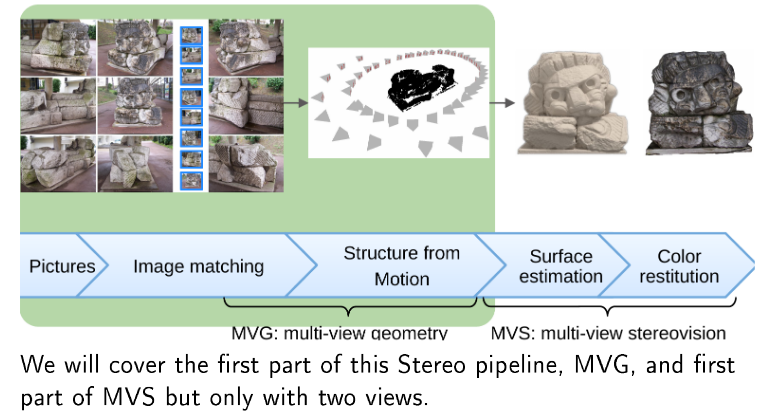

# 3D Computer Vision

*Source: course slides (Pascal Monasse)*

This course had 4 assignments:

* [Panorama](Panorama_Initial/Panorama_Initial)

* [Fundamental matrix estimation](Fundamental_Initial)

* [Disparity map estimation with local methods (using seeds)](Seeds_Initial)

* [Disparity map estimation with graph cuts](GCDisparity_Initial)

All the code is in C++ and can be compiled using the `CMakeLists.txt` on each directory.
